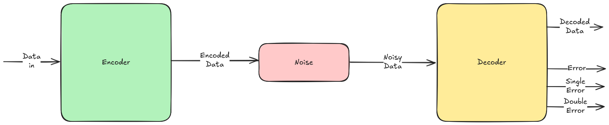
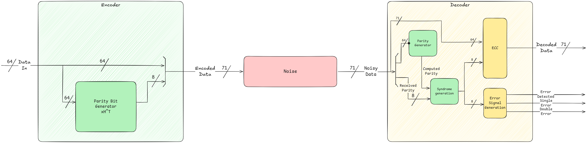
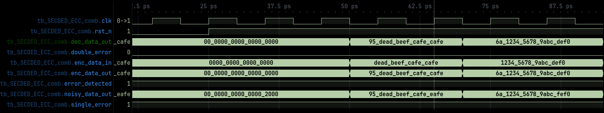
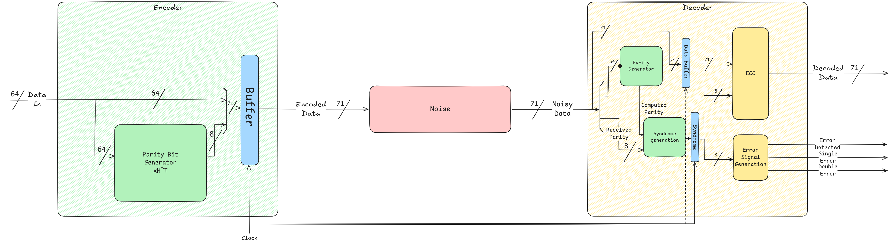
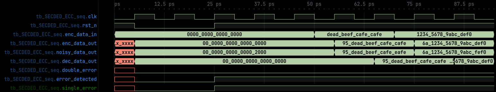

# SECDED ECC implementation

This is an implementation of the SECDED by M. Y. Hsiao on 64 bits using the optimized table 2 (Fig. 6 of the doc).

The structure is divided in Encoder and Decoder with the addition of a noise 
module to add some bit flips to simulate a transmission

## Dependencies 
- `make`
- `iverilog`
- `vvp`
- `gtkwave`

## Project structure

- `./src`: folder containing the source files
    - `/combinational`: combinational implementation
    - `/sequential`: sequential implementation
    - `noise.sv`: module used to induce noise
    - `tb_seq.sv`: used to test the sequential RTL
    - `tb_comb.sv`: used to test the combinational RTL
- `./Makefile`: used to launch the simulation
    - `make` or `make run`: builds all the simulations
    - `make run_seq`: runs the sequential simulation
    - `make run_comb`: runs the combinatorial simulation
    - `make wave_seq`: opens gtkwave to analyze the sequential waveform
    - `make wave_comb`: opens gtkwave to analyze the combinatorial waveform
    - `make clean`: cleans the environment

## Structure and Timing analysis

A timing constraint was set: the Encoder/Decoder must stay in 1 clock cycle. 
This can be interpreted in two ways:

### Combinational circuit

The sum of the timings of both module must stay in a clock cycle, thus the modules must not contain any sequential statements and the timing diagram would look like this

This could be used for memories were both encoding and decoding must stay under one clock.

### Sequential circuit

In this case the assumption is that each single module takes one clock cycle
and some sequential modules are present. The resulting timing diagram would be

This could be used in communications systems but maybe an hamming code (7,4)
could be more useful, but it depends as always.  

### Sources:
- [Communications Systems theory notes (Bachelor degree)](https://github.com/ilnerdchuck/CN-Appunti/blob/main/main.pdf)

- [M. Y. Hsiao](https://people.eecs.berkeley.edu/%7Eculler/cs252-s02/papers/hsiao70.pdf)

- [Single Error Correction and Double Error
Detection (SECDED) with CoolRunner-II™
CPLDs](https://docs.amd.com/v/u/en-US/xapp383)
